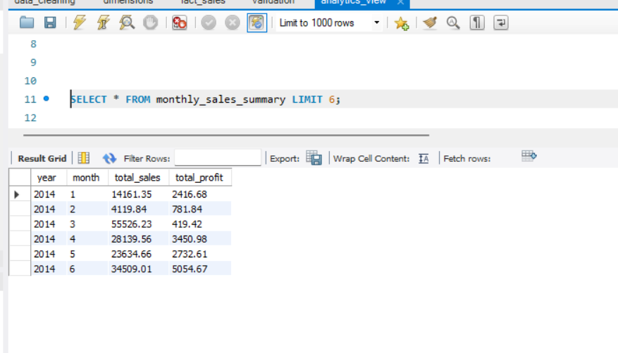

# Retail Superstore – SQL Data Modeling & Analytics Engineering

## Project Overview
This project demonstrates end-to-end SQL data engineering using a retail Superstore dataset.
The focus is on **data cleaning, dimensional modeling, fact table creation, validation, and analytics-ready views** using MySQL.

---

## Dataset
- **Source**: Kaggle – Superstore Sales Dataset
- **Format**: CSV
- **Records**: ~9.6K rows
- **Domain**: Retail sales transactions

---

## Objectives
- Clean and preprocess raw transactional retail data
- Design a **star schema** with fact and dimension tables
- Build a centralized fact table using SQL joins
- Perform data validation using business rules
- Create analytics-ready views for reporting

---

## Data Cleaning
- Converted raw **Order Date** and **Ship Date** fields from text to SQL `DATE` format
- Created clean date columns for analytics usage
- Verified numerical fields such as sales, quantity, and discount for invalid values

---

## Data Modeling
A star-schema data warehouse was designed with the following structure:

### Fact Table
- **fact_sales**
  - Stores order-line level transactional sales data

### Dimension Tables
- **dim_customer** – customer details and segmentation
- **dim_product** – product hierarchy (category and sub-category)
- **dim_location** – geographic attributes (country, state, city, region)
- **dim_date** – calendar attributes for time-based analysis

---

## Data Validation
Basic data quality checks were implemented:
- Verified no negative sales values
- Ensured quantity values are positive
- Confirmed discount values fall between 0 and 1
- Matched row counts between raw data and fact table to ensure completeness

---

## Analytics View
An analytics-ready view was created:

- **monthly_sales_summary**
  - Aggregates total sales and profit by year and month

---

## Sample Output
Below is a sample output from the `monthly_sales_summary` view:

---

## Key Insights
*(Based on the sample output above)*

- Monthly sales and profit can be easily tracked using the analytics-ready warehouse structure.
- Sales generally increase across months, indicating overall business growth over time.
- Some months show high sales but comparatively lower profit, suggesting the impact of discounts on margins.
- The star schema enables efficient time-based aggregation suitable for dashboards and reporting.

---

## Tools & Technologies
- MySQL
- SQL
- Kaggle Dataset

